# 03-DebugBlockbreaker-IEbner
DebugBlockbreaker ist eine Aufgabe auf der Basis vom Blockbreaker Game.
Es soll den Umgang mit Versionieren auf GitHub, Fehlern finden und beheben und Klassendiagrammen beibringen.

**Dev Platform**: Windows 11, Unity 2022.3.9f1, Visual Studio 2019

**Leasons Learned**: Versionierung auf Gitub, nach jeder Änderung pushen, Fehler einzeln bearbeiten, Klassendiagramme

```mermaid
classDiagram
    MonoBehaviour <|-- SceneLoader
    MonoBehaviour <|-- Level
    MonoBehaviour <|-- Ball
    MonoBehaviour <|-- LoseCollider
    MonoBehaviour <|-- GameSession
    MonoBehaviour <|-- Block
    MonoBehaviour <|-- Paddle

    class Ball {
        + paddle1: Paddle
        + xPush: float
        + yPush: float
        + ballSounds: AudioClip[]
        + randomFactor: float

        - paddleToBallVector: Vector2
        - hasStarted: float

        - myAudioSource: myAudioSource
        - myRigidBody2D: Rigidbody2D
        + Start() void
        + Update() void

        - LaunchMouseClick() void
        - LockBallToPaddle() void
        - OnCollisionEnter2D(collision: Collision2D) void

    }
    class Level {
        - breakableBlocks: int
        - sceneLoader: SceneLoader

        - Start() void
        + CountBlocks() void+ BlockDestroyed() void
        - LoadEndScreen() void
    }
    class SceneLoader {
        - GAMEOVERSCREEN: const string
        - CONGRATSCREEN: const string
        - LEVELS: const string

        + LoadNextScene() void
        + LoadWelcome() void
        + LoadCongrats() void
        + IsLastPlayScene() bool
    }

    class LoseCollider {
        + loader: GameObject
        - sceneLoader: SceneLoader

        - Start() void
        - OnTriggerEnter2D(collision: Collider2D) void
    }

    class GameSession {
        + gameSpeed: float
        + pointsPerBlockDestroyed: int
        + scoreText: TextMeshProUGUI
        + isAutoPlayEnabled: bool

        + currentScore: int

        - Awake() void
        - Start() void
        - Update() void
        + AddToScore() void
        + ResetGame() void
        + isAutoPlayEnabled() bool
    }

    class Block {
        - BREAKABLE: const string
        - UNBREAKABLE: const string 

        + breakSound: AudioClip
        + blockSparklesVFX: GameObject
        + hitSprites: Sprite[]

        - level: Level
        - gameStatus: GameSession

        - timesHit: int 

        - Start() void
        - CountBreakableBlocks() void
        - OnCollisionEnter2D(collision: Collision2D) void
        - HandleHit() void
        - ShowNextHitSprite() void
        - DestroyBlock() void
        - PlayBlockDestroySFX() void
        - TriggerSparkleVFX() void

    }

    class Paddle {
        + minX: float
        + maxX: float
        + screenWidthInUnits: float

        - theGameSession: GameSession
        - theBall: Ball

        - Update() void
        - GetXPosition() float

    }
```

